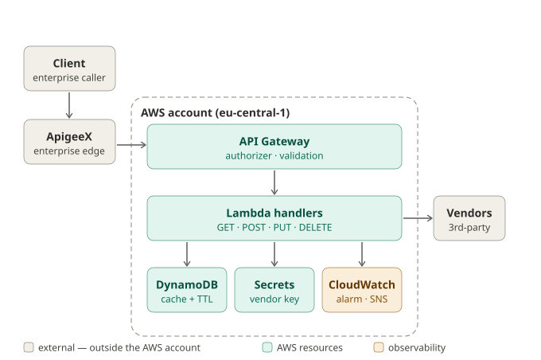

# Architecture

The dashed box marks the trust boundary: everything inside it is created and controlled by the
CDK stack and runs in the project's AWS account; everything outside it — the client, ApigeeX, and
the vendor APIs — is a system the project does not own and therefore cannot trust by default.
Every arrow that crosses that boundary is a place where authentication, validation, or resilience
must happen.

## External systems

- **Client** — whatever enterprise system calls the API.
- **ApigeeX** — runs on Google Cloud, not AWS, so it sits outside the account by definition. It is
  the enterprise edge handling org-wide concerns (OAuth2/JWT, rate limiting, governance) across all
  of the company's APIs, regardless of backend.
- **Vendor APIs** (LexisNexis, Verisk, HLDI) — third parties the service calls out to, which is why
  each vendor call is wrapped in a circuit breaker and a timeout.

None of these three are under the project's control, so each boundary crossing is a trust decision.

## Request lifecycle

**Read:** client → ApigeeX (authenticates, throttles) → API Gateway (validates the request, runs
its authorizer) → GET Lambda → check DynamoDB (cache); on a miss, read the key from Secrets Manager
and call the vendor behind the breaker, then write the result back to DynamoDB with a TTL.

**Write (POST/PUT/DELETE):** the same path to a Lambda that performs a conditional, version-checked
write.

Throughout, the Lambdas emit logs, metrics, and traces to CloudWatch; when the breaker opens, that
metric trips an alarm that notifies via SNS.

## Internal components

- **API Gateway** — the AWS-native front door (validation, routing, stage deployment).
- **Lambda handlers** — thin adapters over the domain layer; they hold the business logic.
- **DynamoDB** — combined cache and durable store (TTL applies only to cache items).
- **Secrets Manager** — holds the vendor key, read at runtime and never baked into code.
- **CloudWatch + SNS** — the observability plane (metrics via EMF, alarm, dashboard, notifications).

## Why two gateways

ApigeeX provides one consistent governance and security boundary for every API regardless of
backend; the AWS API Gateway handles the AWS-specific concerns for this service. They are
complementary, not redundant.

## Where Phase 0 fits

The most important boundary crossing is at the API Gateway box. Phase 0 makes the
"authorizer · validation" label real: a JWT authorizer runs on every method (validating the
bearer token's signature via JWKS plus issuer, audience and expiry), and the stage is throttled
(with a prod WAF in front). Because a valid token is now required, a caller hitting the raw API
Gateway URL is rejected — the Apigee-bypass hole is closed. The authorizer points at a per-env
IdP (issuer/audience/JWKS URI in `config/index.ts`), which must be set before the API is usable,
the same way the vendor secret must exist before the GET path works.

## Scope of this diagram

This shows the runtime (data) plane. The deploy (control) plane — CDK → CloudFormation provisioning
these resources, and GitHub Actions assuming a role via OIDC to run it — sits alongside this, not in
the request path, and is omitted here to keep the trust boundary legible.
